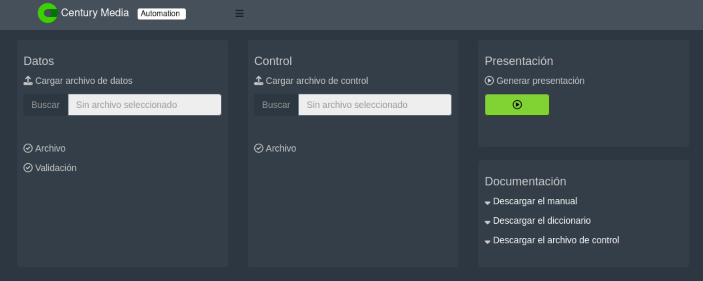
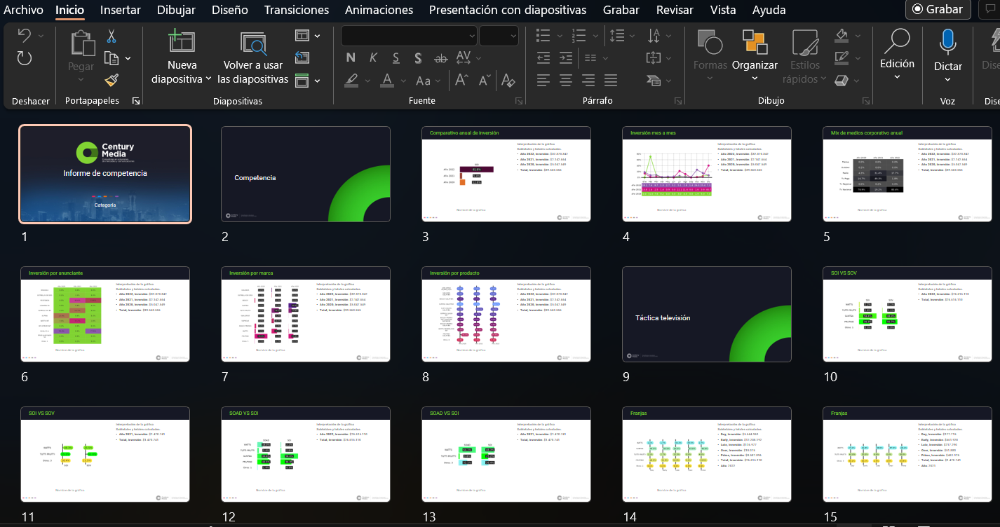

El mundo del marketing es un mundo en constante evolución, donde la tecnología y los datos son los pilares fundamentales para el éxito de una estrategia de marketing efectiva. En este contexto, los datos de la competencia son una herramienta clave para entender el mercado y mejorar la posición de una marca en él. Sin embargo, el proceso de análisis de estos datos puede ser tedioso y consume mucho tiempo, como le sucedía a nuestro cliente [Century Media](https://century-media.net/){target="_blank"}. En este post, te contamos cómo ayudamos a Century Media a optimizar su proceso de análisis de datos con nuestra solución a medida.

En esta ocasión nuestro cliente fue Century Media. Una agencia de medios de capital nacional con más de 20 años de experiencia en el mercado. Como consultores de marca, aplican la estrategia adecuada, el entendimiento de los datos y las habilidades propias de negociación para conectar las marcas con sus audiencias de forma inusual. Con su conocimiento y experiencia, Century Media se especializa en entender los hábitos, preferencias, motivaciones y actitudes de la gente, así como las variables de cada mercado, logrando conexiones inteligentes entre las marcas y sus consumidores.

A pesar de su vasta experiencia, Century Media tenía un problema en su proceso de análisis de datos. Aunque el análisis descriptivo de los datos de pauta de la competencia era parte de su proceso, este se realizaba en hojas de cálculo de MS Excel y se presentaba en MS PowerPoint. Este proceso era tedioso y llevaba mucho tiempo, lo que afectaba la productividad y aumentaba el desgaste del equipo.

Para abordar este problema, nuestro equipo de desarrollo diseñó una solución a medida para Century Media. Generamos un flujo de datos con una interfaz intuitiva que permite a los analistas de Century Media introducir un archivo en el que reposan los datos de pauta de toda la categoría, junto con un archivo de configuración que dicta los colores y formatos para la presentación. Con solo un click, se obtiene la presentación en formato .ppt que se necesita.

Esta solución permitió a los analistas de Century Media ahorrar tiempo y esfuerzo, ya que eliminaron la necesidad de construir gráficas y tablas dinámicas, y la subsiguiente construcción de la presentación a partir de estos. Ahora pueden dedicar su tiempo a analizar los resultados y generar conclusiones que les permitan mejorar sus estrategias de marketing.

Si eres una empresa que necesita analizar datos de la competencia para mejorar tus estrategias de marketing, nuestro equipo está aquí para ayudarte. Con nuestras soluciones personalizadas, puedes ahorrar tiempo y aumentar la productividad de tu equipo de analistas. Contáctanos para obtener más información sobre cómo podemos ayudarte a mejorar tus procesos de análisis de datos e impactar tus estrategias de marketing.