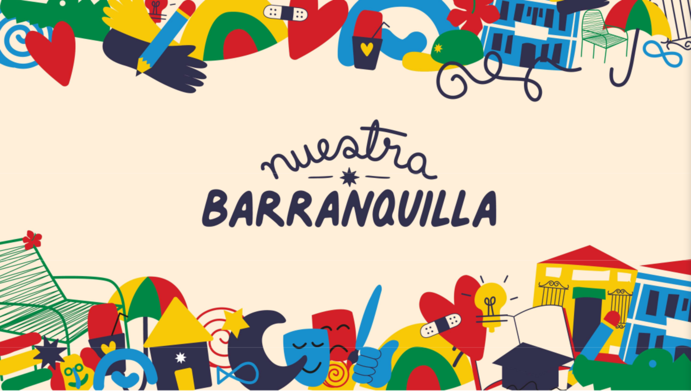
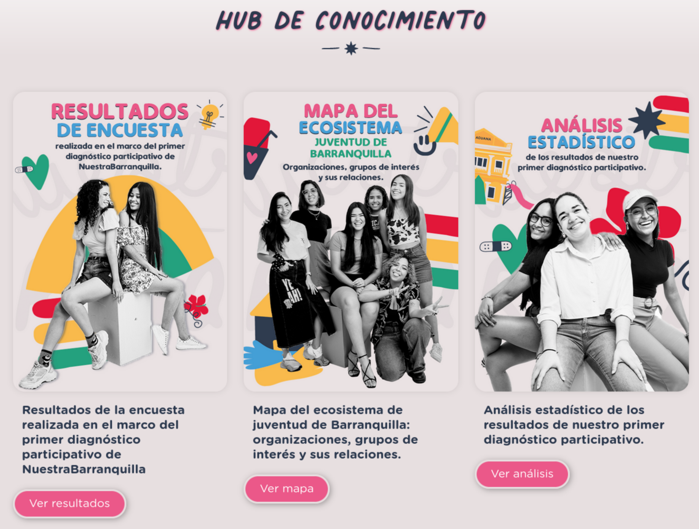
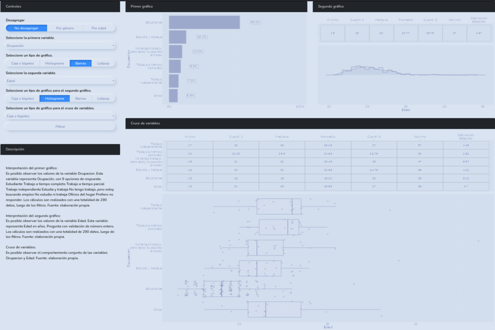

En esta ocasión, queremos compartir la historia de nuestro último proyecto, donde desarrollamos un software a la medida para una iniciativa internacional que buscaba mejorar la calidad de vida de los jóvenes urbanos en todo el mundo.

Nuestro cliente fue el equipo de Diseño Público, quien trabajó en colaboración con la [Fundación Botnar](https://www.fondationbotnar.org/){target="_blank"} y la [Fundación Corona](https://www.fundacioncorona.org/){target="_blank"} para llevar a cabo un proyecto llamado [Nuestra Barranquilla](https://nuestrabarranquilla.com){target="_blank"}. Este proyecto se enmarca dentro de la iniciativa [OurCity](https://www.fondationbotnar.org/project/ourcity-initiative/){target="_blank"}, una iniciativa global que busca crear ciudades más inclusivas y habitables para los jóvenes mediante la utilización de la tecnología, los datos y la colaboración entre sectores.

El equipo de Diseño Público se propuso hacer un diagnóstico de la ciudad de Barranquilla y para ello, realizaron una recolección de datos muy completa de diferentes factores socioeconómicos de los jóvenes de la ciudad por medio de distintos canales. Para poder compartir los datos de manera eficaz y sencilla, el equipo de Diseño Público necesitaba una solución interactiva de visualización de datos. Esta herramienta era la clave para hacer que los hallazgos de su investigación fueran accesibles y comprensibles para una audiencia amplia y diversa.

Fue en este punto que nuestro equipo de desarrollo intervino. Trabajando en estrecha colaboración con el equipo de Diseño Público, creamos un tablero interactivo de inspección de datos que permite a los usuarios obtener estadísticas descriptivas de todas las variables de la encuesta. Los usuarios pueden seleccionar el tipo de gráfico y las variables a cruzar, realizar filtros y desagregaciones, y explorar la información de la encuesta en profundidad. Este aplicativo fue programado en R-Shiny, lo que permitió una disminución significativa en los costos tanto de desarrollo como de despliegue y mantenimiento. Todo esto con el objetivo de presentar los datos de manera clara y concisa.

Gracias a nuestro aplicativo, el equipo de Diseño Público pudo compartir los hallazgos de manera efectiva y logró hacer un diagnóstico preciso de la ciudad de Barranquilla. El aplicativo es muy completo y se encuentra desplegado en la página del proyecto. El equipo de Diseño Público manifestó su satisfacción respecto a nuestro producto y reiteró su afinidad para futuros desarrollos.

Si necesitas una solución efectiva para la visualización de datos, nuestro equipo puede ayudarte. Hemos demostrado nuestra capacidad de colaborar estrechamente con los clientes, comprender sus requerimientos y ofrecer soluciones innovadoras y efectivas que satisfacen todas las necesidades. Contáctanos hoy mismo para obtener más información sobre cómo podemos ayudarte a presentar tus datos de manera efectiva y así llegar a una audiencia amplia y diversa.

