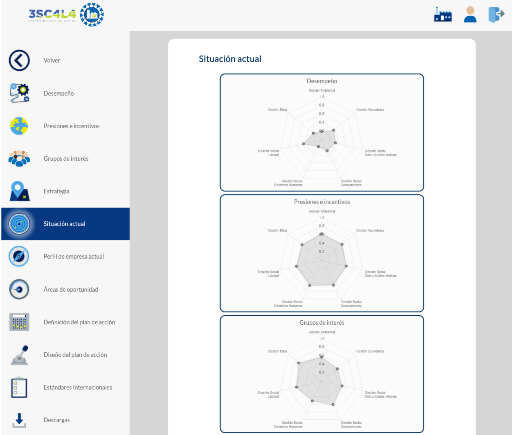

En el contexto académico, el Programa Primeros Pasos en RSE promueve la responsabilidad social en la acción gerencial y empresarial. En este programa, estudiantes, profesores y empresarios interactúan para realizar una intervención y acompañamiento en la propia empresa, comprometiéndose con la implementación de criterios de gestión en el corto plazo.

Se trata de un ejercicio de acercamiento Universidad-Empresa registrado por la [Facultad de Administración de Empresas de la Universidad Externado de Colombia](https://www.uexternado.edu.co/administracion-de-empresas/){target="_blank"}. En este programa, los estudiantes actúan como consultores junior realizando una intervención y acompañamiento al empresario al interior de su propia organización. Los profesores, por su parte, cumplen el rol de consultores senior apoyando en el proceso a los estudiantes y asesorando a los empresarios según su especialidad. Los empresarios actúan como agentes de cambio en la empresa comprometiéndose con la implementación de criterios de gestión en el corto plazo apoyándose en sus respectivos asesores (estudiantes y profesores).

A pesar del avance teórico y robusto del programa, no contaban con herramientas de recolección, almacenamiento, análisis y presentación de la información que permitieran optimizar los procesos. Estaban trabajando con una plantilla de MS Excel que, aunque tenía fórmulas, su mantenimiento suponía un enorme esfuerzo.

Después de una toma de requerimientos y un análisis inicial, diseñamos y desarrollamos la solución que nuestros clientes necesitaban. Usando metodologías ágiles, creamos 3sc4l4, un aplicativo que permite la administración de usuarios y la captura de información de las empresas y sus stakeholders por parte de estudiantes.

Pero [3sc4l4](https://www.3sc4l4.co/){target="_blank"} no solo captura la información, sino que también la analiza. Luego de una recolección de datos preliminar, genera un primer conjunto de analíticas que permiten identificar las oportunidades de mejora de la empresa. Con estas oportunidades identificadas, los estudiantes pueden generar planes de acción con indicadores claros de tiempos, esfuerzo y resultado necesarios para cada uno. Todo este análisis se condensa en un informe final que es presentado a los directivos de las organizaciones participantes.

¡Si tienes una empresa y quieres iniciar en la responsabilidad social empresarial, inscríbete en el programa Primeros Pasos de la Facultad de Administración de Empresas de la Universidad Externado de Colombia! Y si tienes un problema de datos, ¡contacta a nuestro equipo para crear una solución a la medida que se ajuste a tus expectativas! Juntos podemos transformar tus procesos y mejorar la toma de decisiones. ¡Te esperamos!